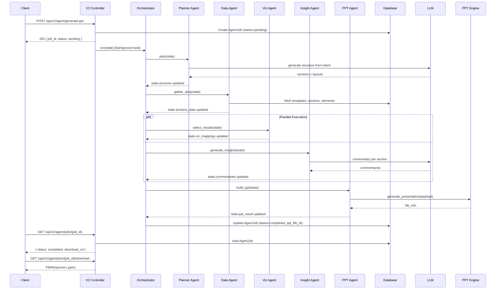

# Agentic Architecture + MCP Implementation Plan

## Current State (Summary)

The backend at [`backend/app/`](backend/app/) follows a clean layered architecture:

- **Routers** (`app/api/v1/`) -- 9 controllers mounted under `/api/v1/*`
- **Services** (`app/services/`) -- `PptService`, `AiService`, `ReportService`, `TemplateService`, `StructureService`, `SectionService`, `SeedService`
- **Repositories** (`app/repositories/`) -- generic `BaseRepository[ModelT]` + 4 concrete repos
- **PPT Engine** (`app/ppt_engine/`) -- `pptx_builder.py` entry with `generate_presentation()` offloaded to thread
- **Schemas** (`app/schemas/`) -- Pydantic models + `ApiResponse` wrapper + `success_response`/`error_response` helpers
- **Core** (`app/core/`) -- `Settings` (pydantic-settings), `database.py` (async SQLAlchemy), `dependencies.py`, `exceptions.py`
- **LLM** -- NVIDIA NIM via `AsyncOpenAI` in `AiService`, with static fallbacks

The `hello/ml/agents/` directory contains a LangGraph-based `BaseAgent` using `create_react_agent` -- useful as a reference pattern but will not be imported directly.

---

## Target Folder Structure

```
backend/app/
├── api/
│   ├── v1/                         # UNTOUCHED - all existing controllers
│   └── v2/
│       ├── __init__.py
│       └── agent_controller.py     # POST /api/v2/agent/generate-ppt, GET status, GET download
│
├── tools/                          # Atomic, reusable capabilities
│   ├── __init__.py
│   ├── base_tool.py                # ToolResult, ToolDefinition, TOOL_REGISTRY, @register_tool
│   ├── data_tool.py                # Fetch data from DB (reports, sections, elements)
│   ├── viz_tool.py                 # Decide chart type / layout from data shape
│   ├── insight_tool.py             # Generate commentary / insights via LLM
│   ├── structure_tool.py           # Generate presentation sections from intent
│   └── ppt_tool.py                 # Wrap PptService.generate_custom_ppt
│
├── agents/                         # LLM-driven orchestration
│   ├── __init__.py
│   ├── state.py                    # AgentState TypedDict (shared state graph)
│   ├── planner_agent.py            # Decompose user intent into section plan
│   ├── data_agent.py               # Gather/validate data for each section
│   ├── visualization_agent.py      # Select chart types, map data to visuals
│   ├── insight_agent.py            # Generate per-section commentary
│   ├── ppt_agent.py                # Assemble final PPT payload + invoke engine
│   └── orchestrator.py             # StateGraph wiring, retry/fallback, entry point
│
├── mcp/                            # Model Context Protocol server
│   ├── __init__.py
│   ├── server.py                   # MCP Server instance + tool registration
│   └── tool_adapters.py            # Thin wrappers: app/tools → MCP-compatible tools
│
├── schemas/
│   ├── ... (existing, untouched)
│   ├── agent_schema.py             # AgentGenerateRequest/Response, AgentOverrides, StepMetric, execution modes
│   └── tool_schema.py              # ToolInput/ToolOutput models per tool
│
├── core/
│   ├── ... (existing, untouched)
│   ├── config.py                   # EXTENDED with new settings (see below)
│   └── llm_client.py              # Unified async LLM client factory
│
├── models/
│   ├── ... (existing, untouched)
│   └── agent_job_model.py          # AgentJobModel for async job tracking
│
├── repositories/
│   ├── ... (existing, untouched)
│   └── agent_job_repository.py     # CRUD for agent jobs
│
├── services/                       # EXISTING services untouched
├── ppt_engine/                     # EXISTING engine untouched
├── utils/                          # EXISTING utils untouched
└── main.py                         # EXTENDED: mount v2 router + optional MCP
```

---

## Module Design

### 1. Tools Layer (`app/tools/`)

Each tool is a standalone async function with strongly-typed Pydantic input/output models. Tools must **not** depend on FastAPI request context -- they accept explicit parameters (DB session, config) and return `ToolResult[T]`.

**`base_tool.py`** -- shared infrastructure + tool registry:

```python
class ToolResult(BaseModel, Generic[T]):
    success: bool
    data: T | None = None
    error: str | None = None
    execution_time_ms: float | None = None   # observability: auto-tracked

    @classmethod
    def ok(cls, data: T) -> "ToolResult[T]": ...
    @classmethod
    def fail(cls, error: str) -> "ToolResult[None]": ...
```

**Tool Registry** (`base_tool.py`) -- future-proof dynamic registration:

```python
class ToolDefinition(BaseModel):
    name: str
    description: str
    fn: Callable                # the async tool function
    input_schema: type[BaseModel]
    output_schema: type[BaseModel]

TOOL_REGISTRY: dict[str, ToolDefinition] = {}

def register_tool(name: str, description: str, input_schema, output_schema):
    """Decorator to auto-register tools into the global registry."""
    def decorator(fn): ...
    return decorator
```

This makes MCP auto-registration trivial (iterate `TOOL_REGISTRY`) and enables dynamic agent tool selection.

**`data_tool.py`** -- reuses `ReportRepository`, `TemplateRepository`:
- `fetch_report_data(session, report_id) -> ToolResult[ReportDataOutput]`
- `fetch_template_sections(session, template_id) -> ToolResult[list[SectionData]]`
- `search_templates(session, query) -> ToolResult[list[TemplateSummary]]`

**`viz_tool.py`** -- stateless logic (no DB, no LLM needed):
- `recommend_chart_type(data_shape: DataShapeInput) -> ToolResult[VizRecommendation]`
- `map_data_to_layout(sections, chart_prefs) -> ToolResult[list[LayoutMapping]]`

**`insight_tool.py`** -- wraps LLM client (reuses `_chat` pattern from `AiService`):
- `generate_commentary(llm_client, context: InsightContext) -> ToolResult[str]`
- `generate_section_insights(llm_client, section_data) -> ToolResult[list[InsightOutput]]`

**`structure_tool.py`** -- wraps `AiService.generate_recommendations` + `StructureService`:
- `generate_structure_from_intent(llm_client, intent: IntentInput) -> ToolResult[PresentationStructure]`
- `refine_structure(llm_client, structure, feedback) -> ToolResult[PresentationStructure]`

**`ppt_tool.py`** -- wraps `PptService`:
- `generate_ppt(session, payload: PptPayload) -> ToolResult[PptOutput]`

### 2. Agents Layer (`app/agents/`)

**`state.py`** -- shared state definition (LangGraph `TypedDict` pattern):

```python
class AgentState(TypedDict, total=False):
    # Input
    intent: str
    audience: str
    tone: str
    presentation_type: str
    mode: str                            # "full" | "structure_only" | "ppt_only"
    dry_run: bool                        # if True, skip PPT generation, return decisions only

    # Deterministic overrides (user can bypass AI decisions)
    overrides: AgentOverrides | None     # chart_type, skip_insights, custom_sections, etc.

    # Pipeline state
    structure: PresentationStructure | None
    sections_data: list[SectionWithData]
    viz_mappings: list[VizMapping]
    commentaries: dict[str, str]
    ppt_payload: dict | None
    ppt_result: PptOutput | None

    # Control
    errors: list[str]
    retry_count: int
    current_step: str

    # Observability
    metrics: dict[str, StepMetric]       # per-step timing + success/failure tracking
```

```python
class StepMetric(BaseModel):
    started_at: float
    ended_at: float | None = None
    duration_ms: float | None = None
    status: Literal["running", "success", "failed", "skipped"]
    error: str | None = None

class AgentOverrides(BaseModel):
    chart_type: str | None = None        # force specific chart type
    skip_insights: bool = False          # skip commentary generation
    skip_viz: bool = False               # skip chart recommendation
    custom_sections: list[dict] | None = None  # user-provided section structure
```

**Agent functions** (each is an async function, not a class -- compatible with LangGraph's `StateGraph.add_node`):

- **`planner_agent.py`** -- `async def plan(state, config) -> dict`: calls `structure_tool.generate_structure_from_intent`, updates `state["structure"]`
- **`data_agent.py`** -- `async def gather_data(state, config) -> dict`: calls `data_tool` for each section, populates `state["sections_data"]`
- **`visualization_agent.py`** -- `async def select_visuals(state, config) -> dict`: calls `viz_tool`, populates `state["viz_mappings"]`
- **`insight_agent.py`** -- `async def generate_insights(state, config) -> dict`: calls `insight_tool` per section, populates `state["commentaries"]`
- **`ppt_agent.py`** -- `async def build_ppt(state, config) -> dict`: assembles payload from state, calls `ppt_tool`, populates `state["ppt_result"]`

**`orchestrator.py`** -- ties it all together:

```
          +----------+
          | planner  |  (skipped if mode=ppt_only)
          +----+-----+
               |
          +----v-----+
          |   data   |  (skipped if mode=structure_only)
          +----+-----+
               |
     +---------+---------+
     |                   |
+----v-----+     +-------v------+
| viz      |     | insight      |  (parallel; each skippable via overrides)
+----+-----+     +-------+------+
     |                   |
     +---------+---------+
               |
          +----v-----+
          |   ppt    |  (skipped if dry_run=True or mode=structure_only)
          +----+-----+
               |
           [DONE / RETRY]
```

Key responsibilities:
- Build `StateGraph` with nodes for each agent
- **Execution modes**: `full` runs all steps; `structure_only` stops after planner; `ppt_only` skips planner and uses provided data
- **Dry run**: runs all decision steps but skips actual PPT file generation -- returns structure, viz mappings, and commentary decisions
- **Deterministic overrides**: if `overrides.chart_type` is set, skip viz_agent and use the override; if `overrides.skip_insights` is True, skip insight_agent entirely
- Conditional edges: after `ppt_agent`, check `state["errors"]` -- if non-empty and `retry_count < 3`, loop back to the failing step
- **Fallback logic**: if `viz_tool` fails, fallback to table layout; if `insight_tool` fails, use static commentary from `AiService._fallback_commentary`
- **Observability**: each step records `StepMetric` (start/end timestamps, duration_ms, status) in `state["metrics"]`
- Provides `async def run_agent_pipeline(request: AgentGenerateRequest, session: AsyncSession) -> AgentGenerateResponse`

### 3. V2 API (`app/api/v2/`)

**`agent_controller.py`** -- three endpoints:

| Method | Path | Description |
|--------|------|-------------|
| POST | `/api/v2/agent/generate-ppt` | Accept intent, kick off orchestrator, return job ID |
| GET | `/api/v2/agent/jobs/{job_id}` | Poll job status + intermediate outputs |
| GET | `/api/v2/agent/jobs/{job_id}/download` | Download generated PPT file |

POST request body (`AgentGenerateRequest`):

```python
class AgentGenerateRequest(BaseModel):
    intent: str                             # "Q1 2025 financial review for board"
    presentation_type: str = "financial"    # financial | business | research
    audience: str = "stakeholders"
    tone: str = "formal"
    mode: Literal["full", "structure_only", "ppt_only"] = "full"
    dry_run: bool = False                   # True = return decisions only, skip PPT file generation
    data_source: DataSourceConfig | None = None  # optional: report_id, template_id, or inline data
    overrides: AgentOverrides | None = None      # deterministic overrides to bypass AI decisions
```

POST response (`AgentGenerateResponse`):

```python
class AgentGenerateResponse(BaseModel):
    job_id: str
    status: Literal["pending", "running", "completed", "failed"]
    mode: str
    dry_run: bool = False
    structure: PresentationStructure | None = None
    ppt_download_url: str | None = None
    steps_completed: list[str] = []
    errors: list[str] = []
    metrics: dict[str, StepMetricResponse] = {}   # per-step timing + status
```

The controller runs the orchestrator asynchronously (via `asyncio.create_task` with DB-persisted job status in `AgentJobModel`) so the endpoint returns immediately with a `job_id`.

### 4. MCP Server (`app/mcp/`)

Uses the `mcp` Python SDK (`pip install mcp`). The server exposes internal tools as MCP-compatible tools without duplicating business logic.

**`server.py`**:

```python
from mcp.server.fastmcp import FastMCP

mcp_server = FastMCP("AutoDeck")

# Tools are registered from tool_adapters.py
```

**`tool_adapters.py`** -- auto-registers from `TOOL_REGISTRY` instead of hardcoding:

```python
from app.tools.base_tool import TOOL_REGISTRY

def register_all_mcp_tools(mcp_server: FastMCP) -> None:
    """Iterate TOOL_REGISTRY and register each as an MCP tool."""
    for name, tool_def in TOOL_REGISTRY.items():
        # Create MCP-compatible wrapper that handles session/llm injection
        @mcp_server.tool(name=name, description=tool_def.description)
        async def _wrapper(**kwargs) -> str:
            result = await tool_def.fn(**kwargs)
            return result.model_dump_json()
```

This means adding a new tool to `app/tools/` with the `@register_tool` decorator automatically exposes it via MCP with zero extra wiring.

MCP is mounted as a sub-application in `main.py` behind a feature flag:

```python
if settings.mcp_enabled:
    from app.mcp.server import mcp_server
    app.mount("/mcp", mcp_server.streamable_http_app())
```

### 5. Configuration Extensions (`app/core/config.py`)

Add to existing `Settings` class:

```python
# Agent / LLM orchestration
llm_provider: str = "nvidia_nim"          # nvidia_nim | openai | azure_openai
llm_api_key: str = ""                     # falls back to nvidia_api_key if empty
llm_base_url: str = ""                    # falls back to nvidia_base_url if empty
llm_model: str = ""                       # falls back to nvidia_model if empty
agent_max_retries: int = 3
agent_timeout_seconds: int = 120
agent_default_mode: str = "full"          # full | structure_only | ppt_only

# MCP
mcp_enabled: bool = False

# Feature flags
agent_mode_enabled: bool = True

# Observability
agent_metrics_enabled: bool = True        # track per-step timing in state["metrics"]
```

The `llm_*` fields fall back to existing `nvidia_*` fields for backward compatibility. A new `llm_client.py` creates a unified `AsyncOpenAI` client from these settings.

### 6. LLM Client Factory (`app/core/llm_client.py`)

```python
async def get_llm_client() -> AsyncOpenAI:
    """Return configured LLM client based on settings."""
    api_key = settings.llm_api_key or settings.nvidia_api_key
    base_url = settings.llm_base_url or settings.nvidia_base_url
    if not api_key:
        raise AiServiceException("No LLM API key configured")
    return AsyncOpenAI(base_url=base_url, api_key=api_key)

async def chat_completion(system: str, user: str, **kwargs) -> str:
    """Shared chat completion helper used by all tools/agents."""
    client = await get_llm_client()
    model = settings.llm_model or settings.nvidia_model
    response = await client.chat.completions.create(
        model=model,
        messages=[{"role": "system", "content": system}, {"role": "user", "content": user}],
        temperature=settings.nvidia_temperature,
        max_tokens=settings.nvidia_max_tokens,
        **kwargs,
    )
    return response.choices[0].message.content or ""
```

### 7. Job Tracking Model (`app/models/agent_job_model.py`)

```python
class AgentJobModel(Base):
    __tablename__ = "agent_jobs"
    id: Mapped[str] = mapped_column(String, primary_key=True, default=lambda: str(uuid4()))
    status: Mapped[str] = mapped_column(String, default="pending")
    intent: Mapped[str] = mapped_column(Text)
    result_payload: Mapped[dict | None] = mapped_column(JSON, nullable=True)
    ppt_file_id: Mapped[str | None] = mapped_column(String, nullable=True)
    steps_completed: Mapped[list] = mapped_column(JSON, default=list)
    errors: Mapped[list] = mapped_column(JSON, default=list)
    created_at: Mapped[datetime] = mapped_column(DateTime, server_default=func.now())
    updated_at: Mapped[datetime] = mapped_column(DateTime, onupdate=func.now())
```

### 8. Error Handling and Resilience

**New exception class** in `app/core/exceptions.py`:

```python
class AgentOrchestrationException(AppException):
    def __init__(self, message: str, step: str, details: list[str] | None = None):
        super().__init__(message=message, status_code=500,
                         error_code="AGENT_ORCHESTRATION_FAILED", details=details)
        self.step = step
```

**New error code** in `ErrorCodes`: `AGENT_ORCHESTRATION_FAILED = "AGENT_ORCHESTRATION_FAILED"`

**Retry logic** (in orchestrator):
- Each agent node wrapped with `tenacity`-style retry: 3 attempts, exponential backoff
- State tracks `retry_count` per step

**Fallbacks**:
- `viz_tool` failure -> default to "table-commentary" layout
- `insight_tool` failure -> use `AiService._fallback_commentary` static text
- `structure_tool` failure -> use `SECTION_FALLBACK` from existing `ai_service.py`
- `ppt_tool` failure -> raise `AgentOrchestrationException` with step context

### 9. New Dependencies (`pyproject.toml`)

```
"langgraph>=0.2.0",
"mcp>=1.0.0",
```

LangGraph provides the `StateGraph` used in the orchestrator. The `mcp` package provides the MCP server SDK.

### 10. `main.py` Changes

Only additive -- append after existing router mounts:

```python
# V2 agent routes (behind feature flag)
if settings.agent_mode_enabled:
    from app.api.v2.agent_controller import router as agent_router
    app.include_router(agent_router, prefix="/api/v2/agent", tags=["agent-v2"])

# MCP server (behind feature flag)
if settings.mcp_enabled:
    from app.mcp.server import mcp_server
    app.mount("/mcp", mcp_server.streamable_http_app())
```


## Critical Improvements (Built Into Design)

### 1. Execution Modes

`AgentGenerateRequest.mode` controls pipeline scope:
- **`full`** (default) -- runs all 5 agents end-to-end, produces PPT
- **`structure_only`** -- runs planner only, returns section structure (useful for preview/approval before committing to full generation)
- **`ppt_only`** -- skips planner, expects `data_source` with existing report/template data, runs data -> viz -> insight -> ppt

The orchestrator checks `mode` before each step and short-circuits accordingly.

### 2. Tool Registry

`TOOL_REGISTRY` in `base_tool.py` is a global `dict[str, ToolDefinition]`. Every tool uses `@register_tool(...)` decorator. Benefits:
- MCP `tool_adapters.py` auto-registers by iterating the registry instead of hardcoding
- Agents can dynamically discover available tools
- New tools are added with zero wiring changes

### 3. Observability / Metrics

`state["metrics"]` is a `dict[str, StepMetric]` populated by the orchestrator around each agent call:
- `started_at`, `ended_at`, `duration_ms` (wall-clock timing)
- `status`: `running | success | failed | skipped`
- `error`: captured exception message if failed

Metrics are persisted into `AgentJobModel.result_payload` and returned in `AgentGenerateResponse.metrics`. Enables: performance monitoring, bottleneck identification, SLA tracking.

### 4. Deterministic Overrides

`AgentGenerateRequest.overrides: AgentOverrides` lets the user bypass AI decisions:
- `chart_type: str | None` -- force a specific chart type, skip viz_agent
- `skip_insights: bool` -- skip insight_agent entirely
- `skip_viz: bool` -- skip viz_agent, use default table-commentary layout
- `custom_sections: list[dict] | None` -- provide section structure directly, skip planner_agent

Makes the system enterprise-ready: users trust AI defaults but can override any decision.

### 5. Dry Run Mode

`AgentGenerateRequest.dry_run: bool = False`. When `True`:
- All decision agents run normally (planner, data, viz, insight)
- PPT agent is skipped entirely -- no file is generated
- Response contains: structure, viz_mappings, commentaries, metrics
- Use cases: preview what the AI would generate, validate decisions before committing resources, testing

---

## Flow Diagram (V2 Agent Request)



---

## MCP Tool Mapping

| MCP Tool Name | Internal Tool | Description |
|---|---|---|
| `generate_ppt_structure` | `structure_tool.generate_structure_from_intent` | Create section plan from intent |
| `fetch_report_data` | `data_tool.fetch_report_data` | Get report with sections/elements |
| `recommend_chart_type` | `viz_tool.recommend_chart_type` | Chart recommendation from data shape |
| `generate_commentary` | `insight_tool.generate_commentary` | AI commentary for a section |
| `build_presentation` | `ppt_tool.generate_ppt` | Build PPT from assembled payload |
| `search_templates` | `data_tool.search_templates` | Search available templates |

---

## Edge Cases and Failure Handling

- **LLM unavailable**: All tools that call LLM check for empty API key first and return `ToolResult.fail()`. Agents check tool results and use fallback paths (static data from `SECTION_FALLBACK`, `_fallback_commentary`).
- **PPT generation crash**: `ppt_tool` catches all exceptions from the engine, wraps in `ToolResult.fail()`. Orchestrator marks job as `failed` with error details.
- **Job timeout**: Background task has `asyncio.wait_for` with `settings.agent_timeout_seconds`. On timeout, job is marked `failed`.
- **Partial success**: If viz fails but insight succeeds, PPT agent builds with table fallback layout. Steps completed are tracked per-step in `AgentJobModel.steps_completed`.
- **Concurrent requests**: Each request gets its own `AgentState` and `AgentJobModel` row. No shared mutable state.
- **DB session management**: Background task creates its own session via `async_session_factory()` (not the request-scoped session).
- **Empty data**: If no report/template data is found, data_agent returns empty sections. Viz is skipped, insight generates generic commentary, PPT renders a minimal deck with a "no data" message slide.
- **Dry run with failure**: Even in dry_run mode, if planner or viz fails, errors are captured in metrics and returned to the client without PPT generation attempt.
- **Override conflicts**: If user sets both `overrides.chart_type` and `overrides.skip_viz`, the override takes precedence (viz_agent is skipped, forced chart type is used).

---

## Future Extensibility

- **Streaming**: V2 endpoint can add SSE (`text/event-stream`) to push step-by-step progress to the frontend, using `metrics` for real-time step status
- **New tools**: Drop a new `*_tool.py` in `app/tools/` with `@register_tool` decorator -- auto-exposed via MCP and available to agents via `TOOL_REGISTRY`
- **Multi-LLM**: `llm_client.py` factory pattern supports adding Azure OpenAI, Anthropic, etc. by extending provider config
- **Human-in-the-loop**: LangGraph supports interrupt/resume -- can add approval checkpoints (e.g., approve structure before generating PPT). The `mode=structure_only` already enables a manual two-phase workflow
- **Webhook callbacks**: `AgentJobModel` can gain a `callback_url` field to POST results when done
- **Data connectors**: `data_tool` can be extended with Snowflake/external API fetchers (the `hello/ml` stack has reference code for this)
- **Observability dashboard**: `metrics` data in `AgentJobModel` can power a monitoring UI showing average step times, failure rates, and bottleneck identification
- **A/B testing**: `mode` + `overrides` enable running the same intent through different strategies (e.g., AI-picked charts vs. user-forced charts) and comparing output quality
